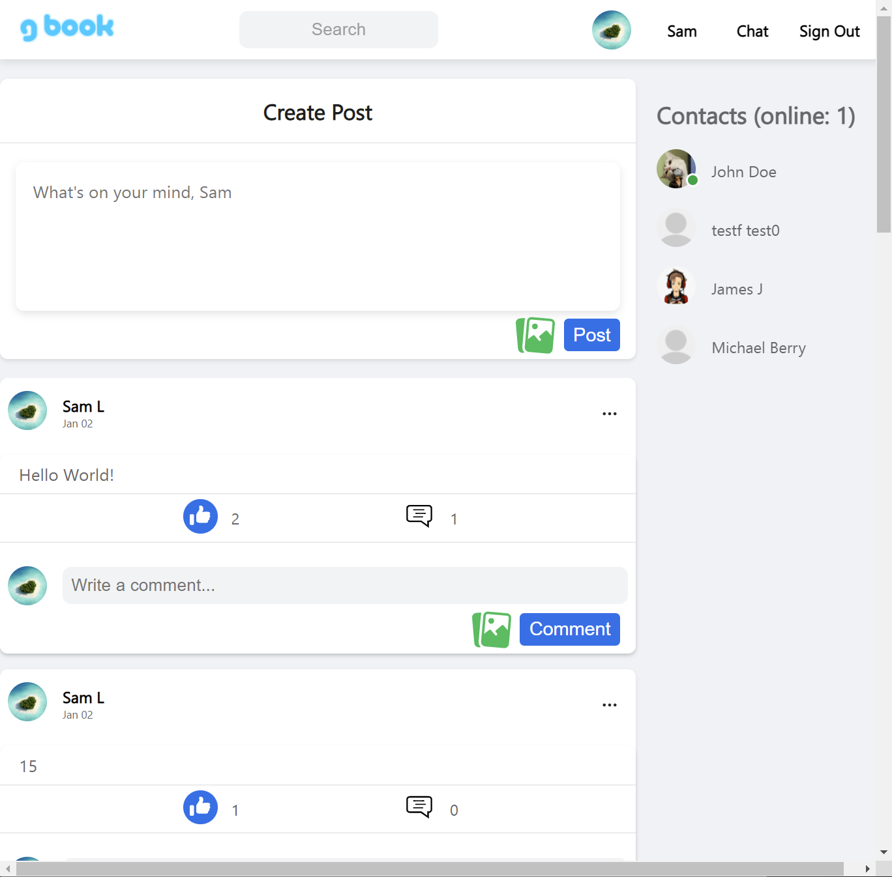

# OdinBook client

# Description

    OdinBook client is a full-stack created for The Odin Project final project.
    It is a social web application similar to FaceBook.

- [Live Demo](https://samgliu.github.io/Odinbook-Client/)

# Repositories

Server repository: https://github.com/samgliu/Odinbook-Server  
socket.io server: https://github.com/samgliu/Odinbook-socketio-server  
Server API Demo: https://odinbook-server.onrender.com

Client repository: https://github.com/samgliu/Odinbook-Client  
Client Demo: https://samgliu.github.io/Odinbook-Client/

# Built With

- React
- HTML/Javascript/CSS

# Feature:

- Sign up/in/out
- Post/Comment/Like add/delete with picture
- Friend with other users
- Profile Edit
- Chat real-time with notification
- Infinite scrolling posts
- CI/CD
